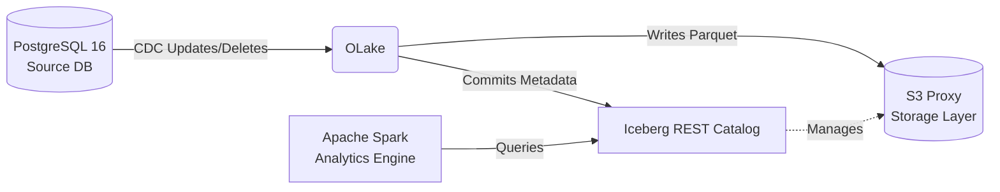

# End-to-End Lakehouse Ingestion Pipeline
  

A turnkey, robust, and reproducible repository demonstrating an end-to-end Lakehouse ingestion pipeline. This pipeline showcases real-time Change Data Capture (CDC) from an operational database (PostgreSQL) into an open data lake (Apache Iceberg) utilizing OLake. 

## Architecture & The "Why"

Historically, moving data from operational databases (like PostgreSQL) to analytical data warehouses involved heavy, nightly Extract-Transform-Load (ETL) jobs. You couldn't easily query live data as it changed without burdening the transactional system. 

This pipeline solves the problem by pairing **OLake** with **Apache Iceberg**:
- **True CDC to Data Lakes:** OLake continuously captures every mutation (inserts, updates, deletes) in the source database and writes it directly to object storage in real-time.
- **Equality Deletes & ACID Transactions:** Iceberg natively supports ACID transactions on the data lake. It gracefully applies updates and deletes without requiring expensive, full-table rewrites. 
- **Open Standards:** By storing data in Parquet files and managing it via an Iceberg REST Catalog, there is zero vendor lock-in. Distributed query engines like Apache Spark can read the data precisely in its current transactional state.



## Prerequisites

- [Docker](https://docs.docker.com/get-docker/) & Docker Compose
- Git

## Step-by-Step Setup Guide

### Step 1: Clone & Launch Infrastructure
Start the environment (PostgreSQL source, S3 Proxy, Iceberg REST Catalog) using Docker Compose:
```bash
git clone https://github.com/shreshtha-132/olake-pipeline.git
cd olake-pipeline
docker-compose up -d
```

### Step 2: Verify Initial Seed Data in PostgreSQL
The database automatically seeds 15 rows on startup. Verify they exist:
```bash
docker exec -it postgres-source psql -U postgres -d ecommerce -c "SELECT * FROM orders;"
```

### Step 3: Start OLake UI
Launch the official OLake UI container. This will run alongside your infrastructure:
```bash
curl -sSL https://raw.githubusercontent.com/datazip-inc/olake-ui/master/docker-compose-v1.yml | docker compose -f - up -d
```
You can now log in at `http://localhost:8000` (Default credentials: `admin` / `password`).

### Step 4: Configure & Trigger Replication in OLake UI

1. **Add Source (PostgreSQL):**
   - **Host:** `host.docker.internal`
   - **Port:** `5433`
   - **Database:** `ecommerce`
   - **User:** `postgres`
   - **Password:** `password123`

2. **Add Destination (Apache Iceberg):**
   - **REST Catalog URI:** `http://host.docker.internal:8181`
   - **Warehouse Location:** `s3://warehouse/`
   - **S3 Endpoint:** `http://host.docker.internal:9000`
   - **S3 Access Key:** `admin`
   - **S3 Secret Key:** `password123`

3. Create a pipeline in the UI to replicate the `ecommerce.orders` table and trigger the initial sync.

### Step 5: Initial Replication & Parity Check
Once the initial sync in OLake is complete, query the Iceberg catalog via Spark SQL to verify the rows replicated successfully:

```bash
chmod +x query_spark.sh
./query_spark.sh "SELECT count(*) FROM demo.postgrestoicebergorders_ecommerce_public.orders;"
```

### Step 6: CDC Verification (Updates & Deletes)
Apply real-world mutations to your source database:
```bash
docker exec -i postgres-source psql -U postgres -d ecommerce < mutate_source.sql
```
Trigger the pipeline in OLake to sync the changes. Once finished, query Spark SQL to verify the updates and deletes gracefully propagated to Iceberg:
```bash
./query_spark.sh "SELECT order_id, customer_id, amount, status FROM demo.postgrestoicebergorders_ecommerce_public.orders WHERE customer_id = 102 ORDER BY order_id;"
```

## Comparison Matrix

| Action | PostgreSQL (Source) State | Spark SQL (Iceberg) State |
| :--- | :--- | :--- |
| **Initial Seed** | 15 rows total | 15 rows total |
| **Update Record** | `customer_id=102` is `COMPLETED` | `customer_id=102` is `COMPLETED` |
| **Delete Record** | `order_id=4` removed | `order_id=4` removed |
| **Insert Record** | `order_id=16` created | `order_id=16` created |

## Production Bottlenecks & Troubleshooting

Building this robust architecture required solving three distinct engineering challenges, fully mitigated in this repository:

1. **macOS Container Networking Resolution**
   - *Issue:* OLake UI connecting to services mapped on the host machine via `localhost` fails because `localhost` resolves to the container's own loopback interface.
   - *Solution:* Connections within the OLake UI are explicitly configured to use `host.docker.internal` (e.g., `host.docker.internal:5433` and `http://host.docker.internal:8181`), which correctly bridges the traffic to the host machine's mapped Docker ports.

2. **Spark Ivy Cache Permission Denied**
   - *Issue:* The `apache/spark:3.5.0` container runs as the unprivileged `spark` user, causing Ivy cache crashes (`java.io.FileNotFoundException`) when attempting to download Iceberg dependencies.
   - *Solution:* The `query_spark.sh` wrapper explicitly passes `--user root` to the container, ensuring dependencies seamlessly download to `/root/.ivy2`.

3. **AWS S3 SDK Bundle Dependency Missing**
   - *Issue:* Including only the Iceberg Spark runtime (`iceberg-spark-runtime-3.5_2.12`) results in a `ClassNotFoundException: software.amazon.awssdk.services.s3.model.S3Exception` when interacting with S3Proxy.
   - *Solution:* The `query_spark.sh` wrapper explicitly appends `org.apache.iceberg:iceberg-aws-bundle:1.5.0` to the `--packages` argument, packaging all required AWS networking libraries.
