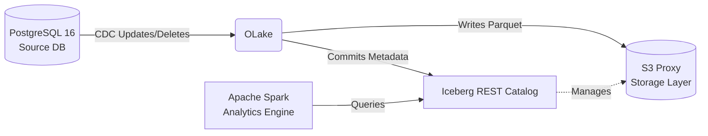

# OLake + Iceberg: End-to-End Lakehouse Ingestion Pipeline

Welcome to this end-to-end Lakehouse ingestion pipeline built for demonstrating **OLake** and **Apache Iceberg**. This repository is designed to showcase how data from an operational database (PostgreSQL) seamlessly lands in an open data lake (Iceberg) via Change Data Capture (CDC), completely bridging the gap between transaction systems and analytics environments.

## Overview

### The Big Picture (In Layman Terms)
Imagine you run an online store. Orders are constantly rolling in, being updated, or getting canceled in your main database (PostgreSQL). You want to run powerful analytics on this data without slowing down your online store. 

Traditionally, you'd extract the data, transform it, and load it (ETL) into a data warehouse every night. But what if you want to analyze it *right now* as it changes?

This architecture solves that by using:
- **OLake**: The "mover". It watches the store's database for *every single change* (new orders, updates, deletions) and instantly writes them to the analytics storage.
- **Apache Iceberg**: The "organizer". It's a special file format that lets analytical engines query the data just like a database table. It gracefully handles updates and deletes without rewriting the whole data pile.
- **Apache Spark**: The "analyzer". A powerful engine to run analytical queries over the organized data.

### Architecture Diagram



---

## 🚀 Setup Guide

### 1. Start the Environment
Run the Docker Compose file to start PostgreSQL, S3Proxy, and Iceberg REST Catalog:
```bash
docker-compose up -d
```

### 2. Configure OLake
* Start OLake locally (usually via its web UI at `http://localhost:8000`).
* **Source PostgreSQL Connection:**
  - Host: `host.docker.internal`
  - Port: `5433`
  - Database: `ecommerce`
  - User: `postgres` / Password: `password123`
* **Destination Iceberg Connection:**
  - REST Catalog URI: `http://host.docker.internal:8181`
  - S3 Endpoint: `http://host.docker.internal:9000`
  - S3 Credentials: `admin` / `password123`
* Create a pipeline to sync the `ecommerce.orders` table.

### 3. Grant Execution Permissions
```bash
chmod +x query_spark.sh
```

---

## 🎬 Two-Act Demo Workflow

### Act 1: Baseline Static Replication
1. **Initialize Source:** The `init-source.sql` script (automatically run on startup) has already populated `ecommerce.orders` with 15 records.
2. **Sync in OLake:** Trigger a full sync in the OLake UI.
3. **Verify Data:**
   Run the Spark SQL client:
   ```bash
   ./query_spark.sh
   ```
   Inside Spark SQL, query the table:
   ```sql
   SELECT COUNT(*) FROM iceberg.ecommerce.orders;
   -- Should return 15
   ```

### Act 2: Active CDC / Mutation Handling
1. **Mutate Data:** Run the mutation script to simulate real-world updates and deletes.
   ```bash
   docker exec -i postgres-source psql -U postgres -d ecommerce < mutate_source.sql
   ```
2. **Sync in OLake:** Trigger a CDC sync in OLake.
3. **Verify Mutations:**
   Run the Spark SQL client again:
   ```bash
   ./query_spark.sh
   ```
   ```sql
   SELECT * FROM iceberg.ecommerce.orders WHERE customer_id = 102;
   -- Status should now be 'COMPLETED'
   
   SELECT COUNT(*) FROM iceberg.ecommerce.orders WHERE customer_id = 104;
   -- Should return 0 (Deleted)
   ```

### Side-by-Side Verification

| Action | PostgreSQL (Source) State | Spark SQL (Iceberg) State |
| :--- | :--- | :--- |
| **Act 1: Initial Sync** | 15 rows total | 15 rows total |
| **Act 2: Update Record** | `customer_id=102` is `COMPLETED` | `customer_id=102` is `COMPLETED` |
| **Act 2: Delete Record** | `customer_id=104` removed | `customer_id=104` removed |

---

## 🧠 Why OLake + Iceberg? (DevRel Value Proposition)
For modern data architectures, **OLake + Iceberg** is a game-changer:
1. **True CDC to Data Lakes:** OLake doesn't just copy files; it understands row-level mutations (Change Data Capture) and applies them directly to the lakehouse.
2. **Equality Deletes:** Iceberg handles deletes and updates gracefully using "equality deletes" and snapshot isolation. You get ACID transactions directly on data lake storage (S3) without the overhead of a massive data warehouse rewrite.
3. **Open Standards:** By using REST Catalog and Parquet files, your data isn't locked into a single vendor. Spark, Trino, and Snowflake can all query the exact same data without moving it.

---

## 🛠️ Troubleshooting Critical Bottlenecks

While building this demo, we encountered and solved three major bottlenecks:

### 1. Cross-Container Networking & macOS Resolution
**Issue:** When configuring OLake (running natively or in another container) to connect to Postgres, Catalog, and S3, using `localhost` failed.
**Solution:** Used `host.docker.internal` in the OLake UI connection strings to properly route traffic from the OLake instance into the mapped ports (`5433`, `8181`, `9000`) of the Docker containers.

### 2. Spark Ivy Cache Permission Denied (`FileNotFoundException`)
**Issue:** Running the Spark SQL docker container resulted in `java.io.FileNotFoundException: /home/spark/.ivy2/cache/...` because the container runs as the unprivileged `spark` user by default.
**Solution:** Passed `--user root` to the `docker run` command (`query_spark.sh`), allowing Ivy to successfully download and cache JAR dependencies.

### 3. Missing AWS SDK S3 Bundle in Spark Runtime
**Issue:** Adding only the Iceberg Spark runtime caused a `ClassNotFoundException: software.amazon.awssdk.services.s3.model.S3Exception` when trying to talk to S3Proxy.
**Solution:** Added the Iceberg AWS bundle to the `--packages` flag in `query_spark.sh`:
`org.apache.iceberg:iceberg-spark-runtime-3.5_2.12:1.5.0,org.apache.iceberg:iceberg-aws-bundle:1.5.0`
